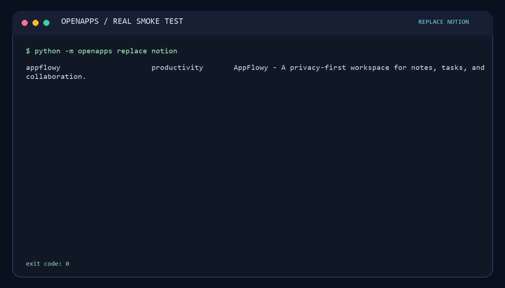

# 🚀 OpenApps

> **💸 Stop paying for software you can own.**

🔍 Find an open-source alternative to the software you already use — then get a reviewable setup plan in seconds.

🧭 OpenApps is a local-first open-source App Store for people who want to replace paid software without handing their data to another directory, account, or AI service.

    🚀 name the paid app  →  🔍 compare alternatives  →  🛡️ review the setup  →  📤 share the find

⭐ If OpenApps saves you time, star the repo and share an alternative you trust.

## ⚡ Try it in under a minute

    python -m pip install -e .

    # 🔍 What can replace the software I already use?
    openapps replace notion

    # 🛡️ What should I review before setup?
    openapps plan appflowy --platform all

    # 📤 Share a useful answer with a teammate
    openapps share appflowy

    # 🌐 Open the local visual storefront
    openapps render --format html --output openapps.html

🌐 Open openapps.html in any browser. Search examples include Notion, Dropbox, TeamViewer, Google Analytics, Typeform, Plex, Retool, and Okta.

## 💡 Why OpenApps?

Most software lists stop at “here is a link.” The expensive part comes next:

- 🖥️ Is this actually a fit for my device or server?
- 🔒 Is my data local, self-hosted, or sent to a cloud?
- ⏱️ How hard is the first setup?
- 🛡️ What should I inspect before I run anything?

✨ OpenApps turns that moment into a short, transparent decision. The catalog is plain JSON, the search works offline, and every upstream project stays linked to its original source.

## ✅ What works today

- 🔍 Intent search: openapps replace notion ranks replacement aliases before generic text matches.
- 📊 Comparison metadata: replacements, platforms, pricing model, privacy model, and setup estimate.
- 🛡️ Reviewable plans: commands are shown for inspection only; OpenApps never executes installation commands.
- 📤 Shareable briefs: copy a concise Markdown explanation with an upstream link.
- 🌐 Local storefront: responsive static HTML with search, filters, comparison cards, and copy-to-share behavior.
- 🧰 27 curated projects, including eight high-intent SaaS replacement journeys.
- 🔐 No account, model, cloud dependency, tracking pixel, or runtime dependency outside Python’s standard library.

## 🛡️ Trust boundary

OpenApps is a discovery and planning layer. It never executes installation commands, downloads software, elevates privileges, or silently changes your machine. A plan is a suggestion to review against the upstream project’s current documentation.

⚠️ Always check the upstream license, release notes, security guidance, storage requirements, and backup plan before deployment.

## 🧰 Commands

| Command | Use |
| --- | --- |
| openapps replace QUERY | Find open-source alternatives to a paid product or use case |
| openapps search QUERY | Search every catalog field |
| openapps show SLUG | Read a Markdown app brief |
| openapps plan SLUG | Print a non-executing setup plan |
| openapps share SLUG | Print a shareable Markdown summary |
| openapps render --format html --output openapps.html | Generate the local storefront |
| openapps doctor | Validate catalog metadata |

## 🌟 The difference

OpenApps is not a paid placement marketplace and not a scraped software mirror. It is a reviewable map from a familiar product to an upstream open-source project, with enough context to make the next decision safely.

## 🗺️ Roadmap

- Verified platform-specific setup plans with upstream source references.
- OS, CPU, memory, storage, license, and maintenance filters.
- Backup, upgrade, and rollback recipes.
- Community-maintained manifests with CI validation.
- A hosted, privacy-respecting storefront built from the same public catalog.

## 🤝 Contributing

Add a useful alternative, correct metadata, or improve the decision flow. Start with [CONTRIBUTING.md](CONTRIBUTING.md) and [the catalog format](docs/catalog-format.md). Every trustworthy contribution makes the map better.

## 🔎 Research

The initial catalog direction is documented in [the GitHub trends research note](docs/research/2026-08-github-trends.md).

## 📄 License

MIT. See [LICENSE](LICENSE).

## 🌐 Try the live demo

**[Open the OpenApps storefront](https://juwonllee2024-dotcom.github.io/openapps/)** in your browser. It is the same static catalog you can generate locally, with no account and no runtime cloud dependency.

This recording was generated from real `replace`, `plan`, `share`, and `render` commands in this repository. Read the exact output in [the smoke-test transcript](assets/openapps-demo-transcript.txt).
